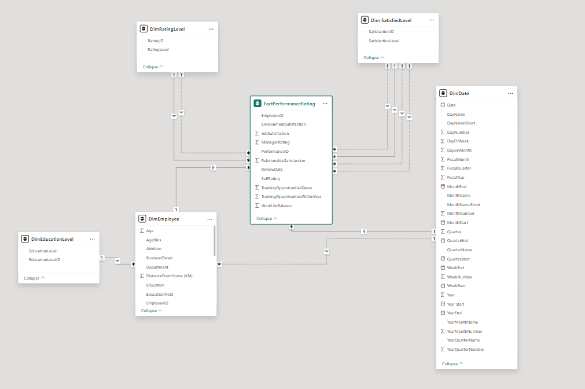

# 👥 HR Analytics - Employee Attrition Analysis


> **Atlas Lab wants to understand what drives employee attrition - and what to do about it.**
> End-to-end HR analytics solution: data model, attrition metrics and an
> executive dashboard designed to guide retention strategy.

---

## 🎯 Business Problem

Atlas Lab needed visibility into employee attrition to move from reactive HR decisions to proactive retention strategy. Without understanding *who* was leaving, *why*, or *when* in the employee lifecycle attrition was most likely to occur, interventions were untargeted and ineffective.

**This project answers three core questions:**
- What organizational and demographic factors most strongly predict attrition?
- Which departments, roles and tenure bands carry the highest attrition risk?
- What specific actions can HR and leadership take to improve retention?

---

## 📁 Dataset & Data Quality

### FactPerformanceRating — Primary fact table
Contains annual employee performance reviews, enabling Atlas Lab to track and manage employee performance on a regular basis.

| Attribute | Detail |
|-----------|--------|
| Source | Atlas Lab HR Dataset |
| Records | ~1,200 employees (active + former) |
| Key variables | PerformanceID, EmployeeID, ReviewDate, EnvironmentSatisfaction |
| Target variable | Attrition (Yes / No) — resolved via `DimEmployee` |

### Dimension tables

| Table | Description |
|-------|-------------|
| `DimEmployee` | Core employee attributes: demographics, tenure, salary, travel |
| `DimEducationLevel` | Education level labels mapped to numeric codes |
| `DimRatingLevel` | Performance rating levels (1-5 scale) | 
| `DimSatisfiedLevel` | Satisfaction level labels (1-5 scale) |
| `DimDate` | Dedicated calculated data table (see DAX below) |

```dax
DimDate = VAR _minYear = YEAR(MIN(DimEmployee[HireDate])) VAR _maxYear = YEAR(MAX(DimEmployee[HireDate])) VAR _fiscalStart = 4 

RETURN
ADDCOLUMNS(
    CALENDAR(
        DATE(_minYear,1,1),
        DATE(_maxYear,12,31)
        ),

"Year",YEAR([Date]), "Year Start",DATE( YEAR([Date]),1,1), "YearEnd",DATE( YEAR([Date]),12,31),
"MonthNumber",MONTH([Date]), "MonthStart",DATE( YEAR([Date]), MONTH([Date]), 1), "MonthEnd",EOMONTH([Date],0),
"DaysInMonth",DATEDIFF(DATE( YEAR([Date]), MONTH([Date]), 1),EOMONTH([Date],0),DAY)+1,
"YearMonthNumber",INT(FORMAT([Date],"YYYYMM")), "YearMonthName",FORMAT([Date],"YYYY-MMM"),
"DayNumber",DAY([Date]), "DayName",FORMAT([Date],"DDDD"), "DayNameShort",FORMAT([Date],"DDD"), "DayOfWeek",WEEKDAY([Date]),
"MonthName",FORMAT([Date],"MMMM"), "MonthNameShort",FORMAT([Date],"MMM"),
"Quarter",QUARTER([Date]), "QuarterName","Q"&FORMAT([Date],"Q"), "YearQuarterNumber",INT(FORMAT([Date],"YYYYQ")), "YearQuarterName",FORMAT([Date],"YYYY")&" Q"&FORMAT([Date],"Q"),
"QuarterStart",DATE( YEAR([Date]), (QUARTER([Date])*3)-2, 1),
"QuarterEnd",EOMONTH(DATE( YEAR([Date]), QUARTER([Date])*3, 1),0),
"WeekNumber",WEEKNUM([Date]),
"WeekStart", [Date]-WEEKDAY([Date])+1,
"WeekEnd",[Date]+7-WEEKDAY([Date]),
"FiscalYear",if(_fiscalStart=1,YEAR([Date]),YEAR([Date])+ QUOTIENT(MONTH([Date])+ (13-_fiscalStart),13)),
"FiscalQuarter",QUARTER( DATE( YEAR([Date]),MOD( MONTH([Date])+ (13-_fiscalStart) -1 ,12) +1,1) ),
"FiscalMonth",MOD( MONTH([Date])+ (13-_fiscalStart) -1 ,12) +1
)
```

### Data Model — Snowflake Schema

The final data model follows a **Snowflake schema** — one dimension table (`DimSatisfiedLevel`) does not connects directly to the fact table, instead linking through `DimEmployee`.

**Satisfaction ratings** (`EnvironmentSatisfaction`, `JobSatisfaction`,
`RelationshipSatisfaction`, `WorkLifeBalance`) all use a 1–5 scale connected
to `DimSatisfiedLevel`, with `EnvironmentSatisfaction` as the active relationship.

**Performance ratings** (`SelfRating`, `ManagerRating`) also use a 1–5 scale
connected to `DimRatingLevel`, with `SelfRating` as the active relationship.

The final model contains **10 individual relationships** across 6 tables.



**Data Quality issues resolved:**
- Satisfactions score columns stored as text instead of numeric -> Converted to integer type during Power Query transformation
- `YearsAtCompany` and `YearsInCurrentRole`contained outlier values -> Validated against hire dates; flagged anomalies before modeling
- Inconsistent `JobRole`naming conventions across departments -> Standardized to a controlled vocabulary in a dimension table

---

## 🔍 Key Findings

**Overall metrics:** Attrition rate of **16.12%** · Averarge Salary **$106,133**

| Insight | Business Implication |
|---------|----------------------|
| Majority of employees are aged **20–29** | Tailor benefits and career development programs to early-career priorities: growth opportunities, mentorship, and flexibility |
| The oldest employee is **51 years old** | Implement knowledge transfer programs and succession planning to protect institutional knowledge as senior employees approach retirement |
| Women represent **2.7%** of active employees | Launch a structured gender diversity initiative: review recruiting pipelines, set representation targets, and audit promotion rates by gender |
| Non-binary employees represent **8.5%** of total employees | Formalize inclusive HR policies, update systems to reflect non-binary identities, and ensure equitable access to benefits |
| White employees have the **highest average salary** | Conduct a formal pay equity audit across all ethnicities; define a timeline to address gaps and publish results internally |
| Employees working **overtime show ~3× higher attrition** | Set overtime thresholds by role; audit workload distribution quarterly; introduce compensatory time-off policy |
| **Sales Representatives** have the highest attrition rate (~40%) | Review Sales compensation structure, commission model, and career path clarity; conduct exit interviews to identify root causes |
| Attrition peaks at **year 0–1** of tenure | Redesign the 90-day onboarding program; assign dedicated buddy/mentor for first-year employees; add 6-month check-in as standard |
| **Frequent travelers** show **1.7× higher** attrition than infrequent and **3× higher** than non-travelers | Audit travel requirements by role; survey employees on travel preferences; introduce travel flexibility or rotation policies |
| **Low job satisfaction + low environment satisfaction** = highest-risk combination | Implement stay interviews at the 6-month mark; add anonymous pulse surveys quarterly |

---

## 📊 Dashboard

🔗 **[View Live Dashboard → Power BI Service](https://app.powerbi.com/view?r=eyJrIjoiZDQzYWY0NDYtM2JlYi00OGI1LTllMTItZTk1NTAyZTNkMDg4IiwidCI6IjRkYTFiNTk3LTkyOGEtNGVkZi04Y2MwLTcwMmFiNjA1NjYyMSIsImMiOjR9)**


The dashboard is structured across **4 pages**, each serving a distinct audience and analytical purpose:

| Page | Purpose | Key Visuals |
|------|---------|-------------|
| **Overview** | Executive summary of workforce composition | Total / Active / Inactive employees · % Attrition Rate · Employees hired over time (stacked by attrition status) · Active employees by department · Treemap: active employees by department and job role |
| **Demographics** | Workforce diversity and compensation profile | Oldest & youngest employee cards · Employees by age bin · Age bin × gender breakdown · Total employees & avg salary by ethnicity · Employees by marital status |
| **Performance Tracker** | Individual employee review history | Employee slicer (full name) · Start date / Last review date / Next review date · 6 line charts tracking all performance scores over time |
| **Attrition** | Deep-dive into attrition drivers | % Attrition rate · By department & job role · By year and quarter trend · By business travel frequency · By overtime status · By years at company |

---

## 🛠️ Technical Approach

### ETL & Data Modeling (Power Query)
- Ingested raw HR flat file; applied type corrections and null handling
- Built **snowflake schema**: `FactPerformanceRating` + 5 dimension tables
- Created `_Measures` table to keep the model organized and measures easy to find

### DAX Measures
```dax
TotalEmployees = COUNT(DimEmployee[EmployeeID])

ActiveEmployees = COUNTROWS(FILTER('DimEmployee', DimEmployee[Attrition] = "No"))

InactiveEmployees = COUNTROWS(FILTER('DimEmployee', DimEmployee[Attrition] = "Yes"))

% Attrition Rate = [InactiveEmployees] / [TotalEmployees]

TotalEmployeesDate = CALCULATE([TotalEmployees], USERELATIONSHIP(DimEmployee[HireDate], DimDate[Date]))

Average Salary = AVERAGE(DimEmployee[Salary])

LastReviewDate = 
IF (
    MAX ( FactPerformanceRating[ReviewDate] ) = BLANK (), 
    "Not review yet",
    MAX ( FactPerformanceRating[ReviewDate] )
)

NextReviewDate = 
VAR reviewOrHire =
    IF(
        MAX(FactPerformanceRating[ReviewDate]) = BLANK(), 
        MAX(DimEmployee[HireDate]), 
        MAX(FactPerformanceRating[ReviewDate])
    )
RETURN reviewOrHire + 365

JobSatisfaction = MAX(FactPerformanceRating[JobSatisfaction])

EnvironmentSatisfaction = CALCULATE(
    MAX(
        FactPerformanceRating[EnvironmentSatisfaction]), 
    USERELATIONSHIP(
        FactPerformanceRating[EnvironmentSatisfaction], 'Dim SatisfiedLevel'[SatisfactionID])
)

RelationshipSatisfaction = CALCULATE(
    MAX(FactPerformanceRating[RelationshipSatisfaction]),
    USERELATIONSHIP(
        FactPerformanceRating[RelationshipSatisfaction], 'Dim SatisfiedLevel'[SatisfactionID])
)

WorkLifeBalance = CALCULATE(
    MAX(FactPerformanceRating[WorkLifeBalance]),
    USERELATIONSHIP(
        FactPerformanceRating[WorkLifeBalance], 'Dim SatisfiedLevel'[SatisfactionID])
)

SelfRating = CALCULATE(
    MAX(FactPerformanceRating[SelfRating]),
    USERELATIONSHIP(
        FactPerformanceRating[SelfRating], DimRatingLevel[RatingID])
)

ManagerRating = CALCULATE(
    MAX(FactPerformanceRating[ManagerRating]),
    USERELATIONSHIP(
        FactPerformanceRating[ManagerRating], DimRatingLevel[RatingID])
)

InactiveEmployeesDate = CALCULATE(
    [InactiveEmployees], USERELATIONSHIP(
        DimEmployee[HireDate], DimDate[Date])
)

% Attrition Rate Date = DIVIDE(
    [InactiveEmployeesDate], [TotalEmployeesDate]
)

```

### DAX Calculated Columns

```dax
FullName = DimEmployee[FirstName] & " " & DimEmployee[LastName]

```


### Power Query — Conditional Columns

**`AgeBins`** — segments employees into age groups for demographic analysis:

```powerquery
= Table.AddColumn(
    #"Changed Type", 
    "AgeBins",
    each if [Age] <= 20 then "<20"
        else if [Age] <= 29 then "20-29" 
        else if [Age] <= 39 then "30-39" 
        else if [Age] <= 49 then "40-49" 
        else if [Age] >= 50 then "50>" 
        else null
    )
```

### Dashboard Design Decisions

- Selected chart-types based on the analytical question each visual answers:
    - Bar charts for categorical comparisons (department, job role, overtime)
    - Line charts for trend analysis over time and across categories.
    - Clustered columns for multi-variable breakdowns (business travel conditions, ethnicity, job role)
- Implemented drill-up and drill-down navigation on date hierarchy (year -> quarter) and job role hierarchy (department -> job role), allowing user to move between summary and granular views without leaving the page.
- Applied a custom corporate color pallete aligned with Atlas Lab's brand identity, ensuring the report feels like an internal business asset rather than a generic template.

---

## 💡 Skills Demonstrated

`Power BI` `Power Query` `DAX` `Snowflake Schema` `HR Analytics` `KPI Design` `Data Modeling` `ETL` `People Analytics` `Data Storytelling` `Report Development`

---

## 📂 Repository Structure
```
hr-analytics-atlas/
├── README.md
├── dashboard/
│   └── screenshots/
│       ├── overview.png
│       └── snowflake_data_model.png
└── insights/
    └── executive_summary.md
```

## 🔗 Portfolio & Contact

| | |
|---|---|
| 🌐 Portfolio | [linktr.ee/dataground](https://linktr.ee/dataground) |
| 💼 LinkedIn | [Juan Fernando Mosquera](https://www.linkedin.com/in/juan-fernando-mosquera-araujo-226966180/) |
| ✍️ Medium | [@erre4tro](https://medium.com/@erre4tro) |

---
*Part of the [Datagroundr4](https://github.com/Datagroundr4) analytics portfolio.*