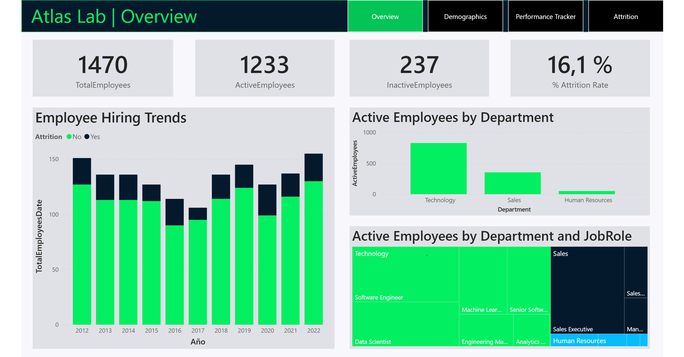

# 👥 HR Analytics - Employee Attrition Analysis


> **Atlas Lab wants to understand what drives employee attrition - and what to do about it.**
> End-to-end HR analytics solution: data model, attrition metrics and an
> executive dashboard designed to guide retention strategy.

---

## 🎯 Business Problem

Atlas Lab was experiencing employee turnover withoput a clear understanding of *who* was leaving. *why*, or *when* in their employee lifecycle attrition was most likely to happen. Withpout this visibility, HR decisiones were reactive rather than strategic.

**This project ansewers three core questions:*
- What organizational and demographic factors most strongly predict attrition?
- Which departments, roles and tenure bands carry the highest attrition risk?
- What specific actions can HR and leadership take to improve retention?

---

## 📁 Dataset & Data Quality

| Attribute | Detail |
|-----------|--------|
| Source | Atlas Lab HR Dataset |
| Records | ~1,400 employees (active + former) |
| Key variables | Department, Role, Tenure, Salary, OverTime, Satisfaction scores |
| Target variable | Attrition (Yes / No) |

**Data Quality issues resolved:**
- Satisfactions score columns stored as text instead of numeric -> Converted to integer type during Power Query transformation
- `YearsAtCompany` and `YearsInCurrentRole`contained outlier values -> Validated against hire dates; flagged anomalies before modeling
- Inconsistent `JobRole`naming conventions across departments -> Standardized to a controlled vocabulary in a dimension table

---

## 🔍 Key Findings

| Insight | Business Implication |
|---------|----------------------|
| Employees working **overtime** show **2.5x highes attrition** | Audit workload distributions; set overtime threshold by role |
| **Sales representatives** have the highest attrition rate (~40%) | Review compensation structure and career path clarity in Sales |
| Attrition peaks at **year 1 and year 5** of tenure | Strenghten 90-day onboarding and year-4 retention interventions |
| Low **job satisfaction + low environment satisfaction** = highest risk combination | Implement stay interviews at the 6-month mark |
| Employees with **no stock option** leave at 3x the rate | Expand equity participation to higher-risk roles |

---

## 📊 Dashboard

🔗 **[View Live Dashboard → Power BI Service](https://app.powerbi.com/view?r=eyJrIjoiZDQzYWY0NDYtM2JlYi00OGI1LTllMTItZTk1NTAyZTNkMDg4IiwidCI6IjRkYTFiNTk3LTkyOGEtNGVkZi04Y2MwLTcwMmFiNjA1NjYyMSIsImMiOjR9)**



**Dashboard Features:**
- Executive summary: overall attrition rate, headcount trend, avg tenure
- Attrition breakdown by department, job role, and education field
- Risk matrix: satisfaction score vs. overtime status
- Tenure cohort view — attirtion rate by years at company
- Dynamic slicers: department, gender, age band, travel frequency

---

## 🛠️ Technical Approach

### ETL & Data Modeling (Power Query)
- Ingested raw HR flat file; applied type corrections and null handling
- Built **star schema**: `fact employees`+ dimension tables for department, role, satisfaction, and demographics
- Created calculated columns for tenure bands and attrition risk tiers

### DAX Measures
```dax
Attrition Rate = DIVIDE(
    CALCULATE(COUNTROWS(Employees), Employees[Attrition] = "Yes"),
    COUNTROWS(Employees)
)

Avg Tenure (Attrition) = AVERAGEX(
    FILTER(Employees, Employees[Attrition] = "Yes"),
    Employees[YearsAtCompany]
)

Overtime Attrition Rate = DIVIDE(
    CALCULATE(
        COUNTROWS(Employees),
        Employees[Attrition] = "Yes",
        Employees[Overtime] = "Yes"
    ),
    CALCULATE(
        COUNTROWS(Employees),
        Employees[Overtime] = "Yes"
    )
)
```

### Dashboard Design Decisions
- Used a **risk matrix** visual (scatter plot: satisfaction vs. overtime) to surface the highest-risk employee segment at a glance
- Separated **operational HR view** (managers) from **strategic view** (C-suite) using bookmarks and page navigation
- Color coding: red = attrition risk, blue = retention strenght — consistent throughout all visuals for cognitve ease

---

## 💡 Skills Demonstrated

`Power BI` `Power Query` `DAX` `Star Schema` `HR Analytics` `KPI Design` `Data Modeling` `ETL` `People Analytics` `Data Storytelling`

---

## 📂 Repository Structure
```
hr-analytics-atlas/
├── README.md
├── dashboard/
│   └── screenshots/
│       └── overview.png
└── insights/
    └── executive_summary.md
```

## 🔗 Portfolio & Contact

| | |
|---|---|
| 🌐 Portfolio | [linktr.ee/dataground](https://linktr.ee/dataground) |
| 💼 LinkedIn | [Juan Fernando Mosquera](https://www.linkedin.com/in/juan-fernando-mosquera-araujo-226966180/) |
| ✍️ Medium | [@erre4tro](https://medium.com/@erre4tro) |

---
*Part of the [Datagroundr4](https://github.com/Datagroundr4) analytics portfolio.*